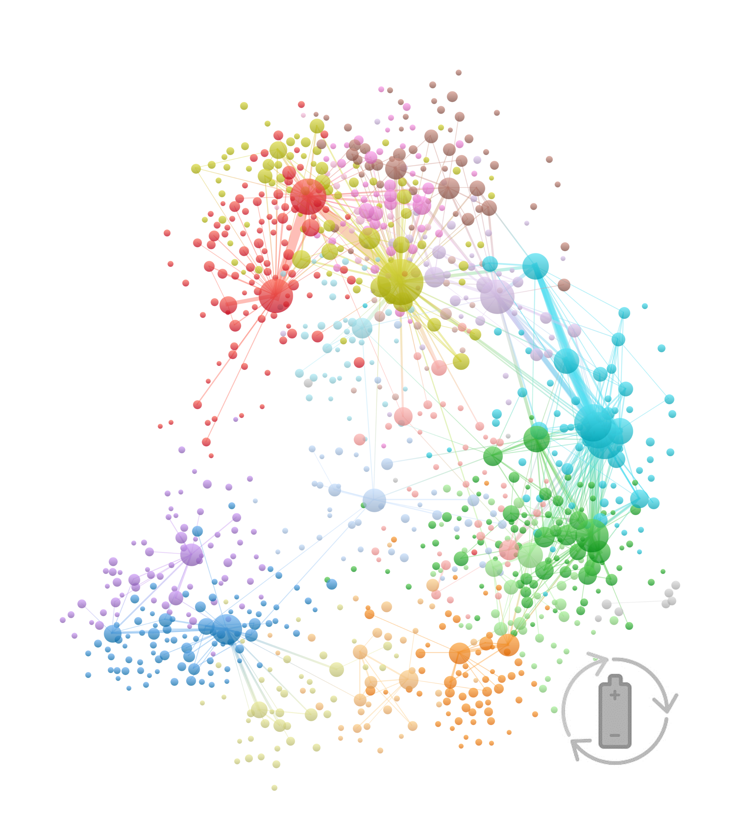
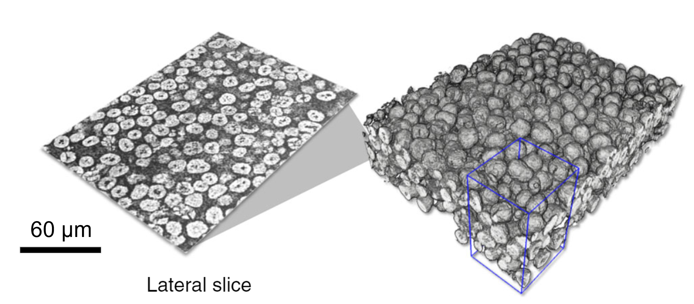
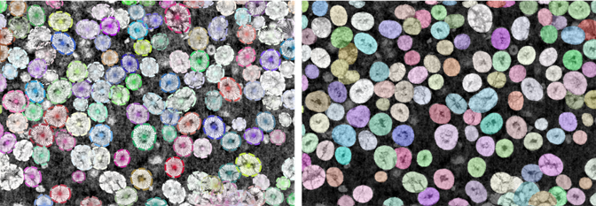
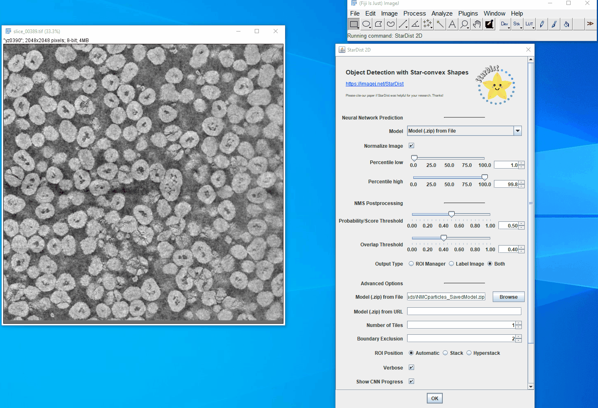
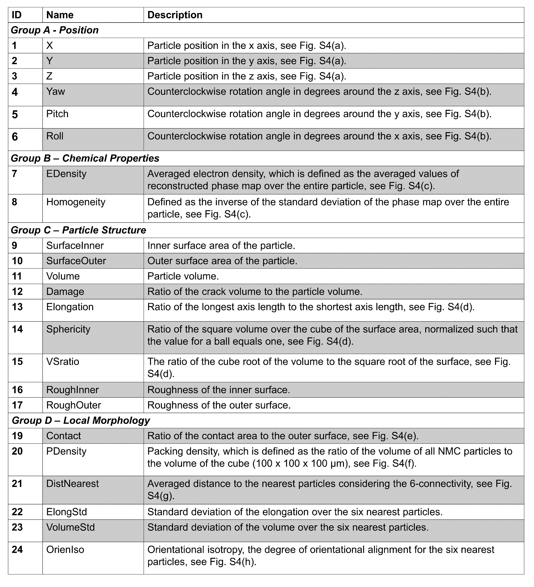
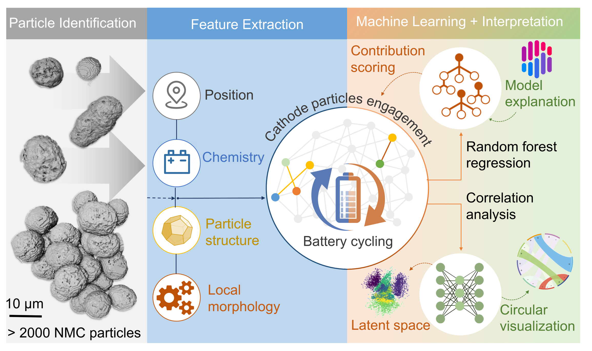

Dynamics of particle network in composite battery cathodes
======

[](https://doi.org/10.5281/zenodo.5888969)




This repository contains the source codes for the study of active particle-network evolution in Ni-rich LiNi<sub>0.8</sub>Mn<sub>0.1</sub>Co<sub>0.1</sub>O<sub>2</sub> (NMC) composite battery cathodes, as described in the following paper:

```
@unpublished{li2021networkevolution,
  title={Asynchronous to synchronous particle-network evolution in composite battery cathodes},
  author={Li, Jizhou and Sharma, Nikhil and Jiang, Zhisen and Yang, Yang and Monaco, Federico and Xu, Zhengrui and Hou, Dong and Ratner, Daniel and Pianetta, Piero and Cloetens, Peter and Lin, Feng and Zhao, Kejie and Liu, Yijin},
  year={2021},
  note={Under review}
}
```
# Background & Key Contributions
- Improving composite battery electrodes requires a delicate control of active materials and electrode formulation. The **dynamics of active particles** have significant impacts but is rarely studied.
- A <ins>network evolution model</ins> is formulated to interpret the regulation and equilibration between electrochemical activity and mechanical damage of active particles. 
- Through statistically analyzing thousands of NMC particles, we found that the local network heterogeneity results in <ins>asynchronous activities in the early cycles</ins>, and <ins>later the particle assemblies move toward a synchronous behavior</ins>. 
- Our study pinpoints the chemomechanical behavior of individual particles and enables better designs of the conductive network to optimize the utility of all the particles during operation.

# Imaging technique
The nano-resolution X-ray phase contrast tomography at the [ID16A-NI nanoimaging beamline](https://www.esrf.fr/UsersAndScience/Experiments/XNP/ID16A) at the [European Synchrotron Radiation Facility](https://www.esrf.fr/) was used to image multi-layer of NMC particles. With high spatial resolution, exceptional contrast, and a large field of view, the 3D imaging data covers a large number of active particles that demonstrate a wide variety of damage patterns. 

<p align = "center">
</p><p align = "center">
Fig.1. 3D microstructure of the composite battery cathode [<a href="https://doi.org/10.1038/s41467-020-16233-5">10.1038/s41467-020-16233-5</a>].
</p>

# Theoretical modeling

The source codes are available from the corresponding author on reasonable request.


# Imaging Data Analysis

## **[Part 1: Morphology-informed Neural Network for Particle Identification](/part1_particle_identification)**


- This implementation extends our [previous work](https://github.com/YijinLiu-Lab/LIBNet) (based on the Mask R-CNN model) by considering the morphology of NMC particles to improve the identification accuracy.    
- Based on the [StarDist](https://github.com/stardist/stardist), which is designed for the cell detection in optical microscopy, the shape of each NMC particle is modeled as a star-convex polygon. Comparing with the traditional watershed algorithm and our [previous method](https://github.com/YijinLiu-Lab/LIBNet), this method shows significantly improved robustness against the formation of the inner-particle cracks, as well as the distinguishablity of closely located particles.


<p align = "center">
</p><p align = "left">
Fig.2. Comparison of different particle identification methods. (a) The particles are densely predicted by a U-Net architecture and then selected the final instances via non-maximum suppression (NMS). (b) The network predicts the star-convex-polygons constrained particles and the probability map is used to obtain the final detection result. (c) The detection results by conventional watershed algorithm and the method in <a href="https://doi.org/10.1038/s41467-020-16233-5">Jiang et al., 2020</a>. (d) Zoomed-in region indicated by red rectangle in (b) to amplify the difference among various methods. Notice the distinguish ability between two particles as indicated by the orange arrows.
</p>


## Installation
This package is compatible with Python 3.6 - 3.9. [TensorFlow](https://www.tensorflow.org/install) is required.

Compile the package by running the following command under the folder [part1_particle_identification](/part1_particle_identification/setup.py).

```
pip install .
```
Note that [Microsoft Visual C++ 14.0](https://visualstudio.microsoft.com/visual-cpp-build-tools/) or greater is required to build the wheel. Alternatively, the pacakge can be directly installed by 
```
pip install stardist
```

## Usage
### 1. Pre-trained model
We provide the [pre-trained model](/models) for identifying NMC particles in nano-resolution X-ray phase contrast tomography images.  

Here is a quick example of how to use the pre-trained model (example image files are provided [here](/part1_particle_identification/example/)):
```
# load the model
model = StarDist2D(None, name='LIB100_70nm', basedir='models')

# perform the prediction
labels, details = model.predict_instances(img)
```

<p align = "center">
</p><p align = "center">
Fig.3. Particle identification results. 
</p>

See more details in [demo_inference.ipynb](/part1_particle_identification/example/demo_inference.ipynb).

An ImageJ plugin is also provided to apply the [trained model](/models/NMCparticles_SavedModel.zip) on the image, thanks to [StarDist](https://github.com/stardist/stardist). The details of the usage instruction can be found [here](https://imagej.net/plugins/stardist). 

<p align = "center">
</p><p align = "center">
Fig.4. Particle identification by the ImageJ plugin with the pretrained model. 
</p>


### 2. Training on your own dataset
Here is a quick example of how to train the model:
```
# X_trn, Y_trn and X_val, Y_val are the training and validation datasets, respectively.
model.train(X_trn, Y_trn, validation_data=(X_val,Y_val), augmenter=augmenter,epochs=50, steps_per_epoch=100)
```
See more details in [demo_training.ipynb](/part1_particle_identification/example/demo_training.ipynb).

The [VGG Image Annotator (VIA)](https://www.robots.ox.ac.uk/~vgg/software/via/) is used for the labeling. See this [blog](https://engineering.matterport.com/splash-of-color-instance-segmentation-with-mask-r-cnn-and-tensorflow-7c761e238b46) for the detailed instruction with an example. 

To save the trained model to be used in ImageJ, the package version should be adjusted, do the following:

```
pip install "tensorflow<2"
pip install "csbdeep[tf1]"
# also install stardist in this example
pip install "stardist[tf1]"
```
and the python script:

```python:
from stardist.models import StarDist2D
model = StarDist2D(None, name='my_model', basedir='.')
model.export_TF()
```


## **[Part 2: 3D Particle Identification by View Fusion](/part2_view_fusion)**  

For challenging cases, some regions may be still missed in single 2D images (e.g. the _xy_ section) due to various factors such as the low contrast and tomography reconstruction artifacts. However, the missing information is often available in other sections, for example the _xz_ and _yz_ views. This observation motivates us to construct a new intermediate representation of a particle <ins>by fusing labels from different sections</ins>. To elucidate this redundancy, the predicted 2D particle labels from _xy_,_yz_ and _xz_ sections are averaged together followed by _a clustering of pixels that converge to the same fixed points_. This procedure ensures that all the particles can be accurately identified and quantified.

<p align = "center">
</p><p align = "center">
Fig.5. 3D particle identification by view fusion. 
</p>

The trained models for NMC particle identification from different views can be found [here](/part2_view_fusion/models).

The linking of labels at different slices is performed by [hungarian algorithm](https://en.wikipedia.org/wiki/Hungarian_algorithm). We use a [fast implementation](https://www.mathworks.com/matlabcentral/fileexchange/20652-hungarian-algorithm-for-linear-assignment-problems-v2-3) to link labels at different slices reduce the label number and improve the fusion performance. 
```
[target_indices , ~, ~] = hungarianlinker(source, target, max_linking_distance);
```

## **[Part 3: Feature Extraction for NMC Particles](/part3_feature_extraction)**
Given the identified 3D NMC particles, we extract their structural, chemical, and morphological characteristics. More specifically, we divide the particle attributes into four different groups: position, chemical properties, particle structure, and local morphology for furture analysis.

<p align = "center">
</p><p align = "center">
Fig.6. Name and description of all extracted attribute from the identified NMC particles. 
</p>


## **[Part 4: Interpretable Machine Learning Framework](/part3_damage_regression)**

The analysis pipeline with the interpretable machine learning framework is illustrated below, where the random forest (RF) is used to regress the particle damage with other attributes. 

<p align = "center">
</p><p align = "center">
Fig.7. Illustration of analysis pipeline with the interpretable machine learning framework. 
</p>

The [SHAP](https://github.com/slundberg/shap) (SHapley Additive exPlanations) is utilized to rank the significance of the particle properties to the degree of particle damaging during the process of regression, which effectively reveals the contributions of different microstructural characteristics to the damage profile for every single particle in our electrode. 

## Installation
SHAP can be installed from either [PyPI](https://pypi.org/project/shap) or [conda-forge](https://anaconda.org/conda-forge/shap):

<pre>
pip install shap
<i>or</i>
conda install -c conda-forge shap
</pre>

## Usage
- A nice explanation about why model interpretation and how SHAP helps random forests can be found [here](http://blog.datadive.net/interpreting-random-forests/). 
- The jupyter notebook to reproduce the results of the non-monotonous correlation between particle properties and damage degrees can be found [here](/part4_damage_regression/randomforest.ipynb).

### Key scripts:
Random Forest Regression
```
dataset = pd.read_csv(filename)
X_train, X_test, y_train, y_test = train_test_split(dataX, datay, test_size = 0.05,random_state = random_statev)
regressor = RandomForestRegressor(...)
regressor.fit(X_train.values, y_train.values)
y_pred = regressor.predict(X_test.values)
```
SHAP Values Calculation
```
explainer = shap.TreeExplainer(regressor)
shap_values1 = explainer.shap_values(X_train)
```

# Conclusion
- The formulated network evolution model provides insights into the regulation and equilibration between electrochemical activity and particle damage. 
- Our experimental investigations and machine learning analysis reveal that there is a ___non-monotonous correlation between particle properties and damage degrees___. 
- Collectively, our results reveal an ___asynchronous-to-synchronous transformation in the cathode electrode___, featuring a set of consecutive processes involving particle activation, electrochemical segregation, and electrode synchronization. 
- Although it seems that a global homogenization will be developed eventually after long-term cycling, <ins>a poorly designed electrode would reach this state when most of its particles are severely damaged</ins>. In contrast, <ins>a well-formed electrode would rapidly converge to the electrode synchronization with majority of its particles still in good shape</ins>. 
